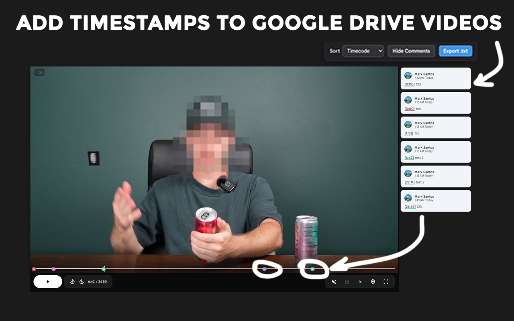

<div align="center">

# 🎬 VidMark


**Frame.io-style timestamped comments for Google Drive video review.**

[](#)
[](#)
[](#)
[](#)

[Features](#-features) · [Getting Started](#-getting-started) · [How It Works](#-how-it-works) · [Tech Stack](#️-tech-stack) · [Project Structure](#-project-structure)

</div>

---

<div align="center">



</div>

---

VidMark turns the Google Drive video player into a real video-review tool. Open a comment while paused and the current timestamp is auto-stamped at the start. Each timestamped comment drops a clickable color-coded circle on the timeline. Click a marker to jump the video and flash the matching comment. Sort comments by timecode, commenter, or completion. Export the whole feedback session to a clean text file with one click.

Built for editors, agencies, marketing teams, and anyone reviewing video files shared over Drive — without paying for, syncing to, or uploading to Frame.io.

---

## ✨ Features

- **Auto-timestamp every comment** — Click *Comment* while paused at any frame and the current video time is inserted as `[m:ss]` at the start of your reply. No more typing timecodes by hand.
- **Live-updating timestamp** — While the comment box is empty, the inserted timestamp tracks your scrubs in real time. The moment you start typing past it, the timestamp locks in.
- **Color-coded timeline markers** — Every timestamped comment drops a clickable circle on the seek bar, each in its own pastel hue (golden-ratio distributed) so adjacent comments stay visually distinct.
- **Click a marker to jump and highlight** — Click any timeline circle and the video seeks to that moment while the matching comment flashes in the same color and scrolls into view.
- **Clickable `[m:ss]` inside comments** — Every timestamp inside every comment becomes a blue underlined link that seeks the video when clicked.
- **Frame.io-style sorting** — Reorder Drive's comment list by Timecode, Oldest, Newest, Commenter, or filter to Completed (resolved). Same modes Frame.io reviewers expect.
- **Hide / Show comments** — One-click toggle that closes the comments panel and expands the video player to fill the freed space (16:9, viewport-aware), then snaps back when you reopen them.
- **Auto-reopen comment box** — After you click *Post Comment*, VidMark auto-clicks the *+ Comment* toolbar button so you can immediately type the next note without losing your place in the video.
- **`#tags` color-code your timeline** — Drop `#fix #color #audio #approve` (or any hashtag) into a comment and the marker on the timeline switches to that tag's color. The floating panel gets a tag filter dropdown that filters both the comments list and the timeline.
- **Search comments + filter the timeline** — Type into the search box and only matching comments + their markers stay visible. Press `/` from anywhere to focus the search.
- **Loop between two markers** — Click *🔁 Loop* in the panel (or press `L`), pick two markers, and the video loops between them on repeat — perfect for tight editing review.
- **Drawing / annotations** — *✏️ Annotate* pauses the video and overlays a canvas; draw on the frame with color + brush-size + undo, save, and the drawing re-displays whenever you scrub back to that moment. Saved locally per video, never transmitted.
- **Side-by-side compare** — Compare two video versions side-by-side via the popup → *Side-by-side compare*. Paste two Drive video URLs and review v1 vs v2 in one tab.
- **Keyboard shortcuts** — `n` new comment · `,` `.` previous / next marker · `/` focus search · `L` loop mode · `Cmd+E` open export · `Esc` close any open menu.
- **Export to nine formats** — One-click export to `.txt`, Markdown, CSV, JSON, printable HTML (save as PDF), `.srt` / `.vtt` subtitles, **`.fcpxml`** for Final Cut Pro & Adobe Premiere, and **`.edl`** for DaVinci Resolve / Avid / any NLE.
- **Toolbar popup menu** — Click the VidMark icon in your Chrome toolbar for quick access to every export format and a Settings panel that toggles each feature on or off (synced across browsers via your Google account).
- **Folder-view support** — Works in Drive's standalone video viewer and in the video preview opened from inside a folder.
- **100% local** — Runs entirely in your browser on `drive.google.com` pages. No account, no server, no telemetry.

---

## 🚀 Getting Started

### Prerequisites

- Google Chrome 110+ or any Chromium-based browser (Edge, Brave, Arc, etc.)
- Access to videos in Google Drive

### Install (developer mode)

```bash
git clone https://github.com/markksantos/VidMark.git
```

1. Open `chrome://extensions` in Chrome
2. Toggle **Developer mode** (top-right)
3. Click **Load unpacked**
4. Select the cloned `VidMark` folder
5. Open any video in Google Drive — VidMark is now active

### Usage

1. Open a video in Google Drive
2. Pause where you want to leave a note, click **Comment**
3. The comment box pre-fills with `[1:45]` (or wherever you're paused)
4. Type your note → **Post Comment**
5. The next comment box opens automatically; rinse and repeat
6. Click any colored circle on the timeline to jump to a timestamped comment
7. Use the floating panel (top-right) to sort comments or export them
8. Click the **VidMark icon** in your Chrome toolbar for the full export menu and feature toggles

---

## 📤 Export Formats

| Format | Extension | Use case |
|--------|-----------|----------|
| Plain text | `.txt` | Quick handoff, email, Slack |
| Markdown | `.md` | GitHub issues, Notion, Obsidian |
| Spreadsheet | `.csv` | Excel, Google Sheets, sortable in any tool |
| JSON | `.json` | Custom tooling, API integration |
| Printable HTML | `.html` | Opens in browser → print → Save as PDF |
| SubRip subtitles | `.srt` | Burn comments into a video as captions |
| WebVTT subtitles | `.vtt` | HTML5 video, modern players |
| **Final Cut Pro / Premiere** | `.fcpxml` | Imports as a project with markers at each timestamp |
| **DaVinci Resolve / EDL** | `.edl` | CMX 3600 EDL with comment metadata — Resolve, Avid, any NLE |

For the NLE formats, all comments are placed as markers at the right timecode on a synthetic track, with the author + comment body as the marker note.

---

## 🔧 How It Works

```
You pause the video at 3:25
  -> Click "Comment"
  -> VidMark reads the seek-slider's value/aria-valuetext
  -> Inserts "[3:25] " into Drive's contenteditable comment editor
  -> You type your note and post
  -> VidMark detects the new comment in the [role="list"], clicks "+ Comment"
  -> Cycle repeats

Existing comments
  -> VidMark walks text nodes for [m:ss] patterns (idempotent, skips contenteditable)
  -> Wraps each match in a clickable span with a stable hue derived from seconds
  -> Overlays a circle on the seek bar at (seconds / duration) * 100%
  -> Click marker  ->  set slider.value via native setter, dispatch input/change
                    ->  Drive seeks the underlying YouTube iframe
                    ->  the matching comment card flashes in the same hue
```

Drive's video is a YouTube iframe (cross-origin) but Drive renders its own seek slider in the parent frame. VidMark reads time from `<input aria-label="Seek slider">` and seeks by setting that input's value via the native setter plus dispatching `input`/`change` events — Drive's own jsaction handlers then proxy the seek to the iframe.

---

## 🛠️ Tech Stack

| Category | Technology |
|----------|-----------|
| Type | Chrome Extension (Manifest V3) |
| Language | Vanilla JavaScript — no build step |
| Architecture | Content script + injected stylesheet |
| Time source | Drive's seek-slider (`<input aria-label="Seek slider">`) |
| DOM detection | `MutationObserver` + `focusin` + safety-net polling |
| Comment editor | `document.execCommand('insertText')` + synthetic paste fallback |
| Layout overrides | CSS `:has()` + custom properties (`--gd-fio-h`, `--gd-fio-player-*`) |
| Dependencies | **Zero** — no npm, no bundler, no frameworks |

---

## 📁 Project Structure

```
VidMark/
├── manifest.json          # MV3 manifest — content script + popup action + storage perm
├── content.js             # All in-page behavior — runs on drive.google.com
│   ├── Settings + storage      # chrome.storage.sync load + onChanged listener
│   ├── 1. Auto-stamp            # insertTimestamp + live updater
│   ├── 2. Timestamps            # wrapAllTimestamps + clickable [m:ss] + #tag parsing
│   ├── 3. Markers               # timeline overlay, hue per timestamp + per tag
│   ├── 4. Sort / Filter / Search # sort modes, tag filter, text search, 9-format export
│   ├── 5. Loop between markers  # set-start / set-end / interval-driven re-seek
│   ├── 6. Drawing / annotations # canvas overlay, save to chrome.storage.local
│   ├── 7. Auto-reopen           # mutation-based detection, click + Comment
│   ├── 8. Hide / expand         # comments panel toggle + video player resize
│   ├── Keyboard shortcuts       # n / , . / / L / Cmd+E / Esc
│   └── Popup messaging          # VIDMARK_EXPORT / VIDMARK_SETTINGS_CHANGED handlers
├── styles.css             # Markers, flash, sort layout, panel + dropdown + annotation UI
├── popup.html / popup.css / popup.js   # Toolbar popup — Export | Settings | About + Compare
├── compare.html / compare.css / compare.js  # Side-by-side compare page (v1 vs v2)
├── icon-16.png            # Toolbar icon
├── icon-32.png            # Windows context menu
├── icon-48.png            # Extensions management page
├── icon-128.png           # Chrome Web Store listing
├── icon-source.png        # 1024×1024 master
├── store-listing.txt      # Copy-paste-ready Chrome Web Store fields
├── PRIVACY.md             # Privacy policy (linked from manifest + Web Store)
└── README.md
```

---

## 🔐 Privacy

- VidMark runs entirely in your browser on `https://drive.google.com/*` and never on any other site
- It does not collect, transmit, sell, or share any data
- It does not require an account, log-in, or external server — no background service worker
- It does not read or modify videos themselves; only the comment text and timeline UI inside Drive
- Permissions: content script injection on `drive.google.com` only — nothing else

---

## 📄 License

MIT License © 2026 Mark Santos

---

<div align="center">

Built by [Mark Santos](https://github.com/markksantos) · Replace Frame.io with the Drive you already pay for.

</div>
